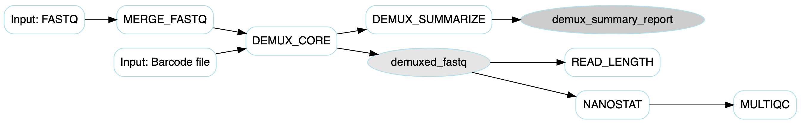

# seqWell-ONT-demux


[](https://github.com/seqwell/seqWell-ONT-demux/actions/workflows/nextflow-ci.yml?query=branch%3Amain)
[](https://www.nextflow.io/)


This is a Nextflow pipeline for demultiplexing ONT FASTQ files using seqWell kit. The pipeline processes multiple FASTQ files by first merging them, then performing demultiplexing, and finally generating summary statistics. The pipeline workflow is streamlined for efficient processing of multiplexed ONT sequencing data.

## Pipeline Overview

The pipeline starts with multiple FASTQ.gz files and follows these key steps:

1. **MERGE_FASTQ**: Collects and merges all input FASTQ files into a single consolidated file for processing
2. **DEMUX_CORE**: Performs the core demultiplexing process using provided barcode sequences to separate reads by sample using cutadapt
3. **DEMUX_SUMMARIZE**: Generates comprehensive summary statistics and reports from the demultiplexing results
4. **READ_LENGTH**: Calculates read length distributions from the demultiplexed FASTQ files.
5. **NANOSTAT**: Produces detailed per-sample sequencing statistics from the demultiplexed FASTQ files.
6. **MULTIQC**: Aggregates results from NanoStat into a single interactive HTML report.


The final output includes demultiplexed FASTQ files organized by sample, detailed summary reports showing read counts by sample, weighted read length distribution plots, and a MultiQC report which interpretated NanoStat reports.



## Dependencies

This pipeline requires installation of Nextflow. It also requires installation of a containerization platform such as Docker.

### Docker Containers
All docker containers used in this pipeline are publicly available. 

- *DEMUX_CORE*: quay.io/biocontainers/cutadapt:5.0--py310h1fe012e_0
- *MERGE_FASTQ*: ubuntu:20.04
- *DEMUX_SUMMARIZE*: ubuntu:20.04
- *READ_LENGTH*: seqwell/python:v2.0
- *NANOSTAT*: quay.io/biocontainers/nanostat:1.6.0--pyhdfd78af_0
- *MULTIQC*: quay.io/biocontainers/multiqc:1.25.1--pyhdfd78af_0


## How to run the pipeline

### Required Parameters

The required parameters are `pool_ID`, `input`  and `outdir`.

#### input
`input` is the path to a directory containing FASTQ.gz files to be demultiplexed. The pipeline will automatically discover all `*.fastq.gz` files in this directory. This can be a local absolute path or an AWS S3 URI. If using an AWS S3 URI, please ensure your security credentials are filled in the nextflow.config file.


#### outdir
The `outdir` directory path is where results will be saved. This can be a local absolute path or an AWS S3 URI. If using an AWS S3 URI, please ensure your security credentials are filled in the nextflow.config file.

#### pool_ID
The pool_ID is a character string which is used to name intermediate files and summary report files produced in the pipeline. 

### Profiles

Several profiles are available and can be selected with the `-profile` option at the command line. Default profile is docker. 

- `awsbatch`
- `docker`


### Example Command

A minimal execution might look like:

```bash
nextflow run \
    main.nf \
    --input "${PWD}/path/to/fastq/directory" \
    --outdir "${PWD}/path/to/output" \
    --pool_ID "test_run"
```

## Running Test Data

The pipeline can be run using test data with:

```bash
nextflow run \
    main.nf \
    --input "${PWD}/test_data/fastq_pass" \
    --outdir "${PWD}/test_output" \
    --pool_ID "test_run" \
    -resume -bg
```


## Expected Outputs

```
├── demuxed_fastq
│   ├── BC_01.seqWell.fastq.gz                              #demuxed reads from each well by seqWell barcode
│   ├── BC_02.seqWell.fastq.gz
│   ├── BC_03.seqWell.fastq.gz
|   ........
│   ├── BC_92.seqWell.fastq.gz
│   ├── BC_93.seqWell.fastq.gz
│   ├── BC_94.seqWell.fastq.gz
│   ├── BC_95.seqWell.fastq.gz
│   └── BC_96.seqWell.fastq.gz
├── demux_summary
│   └── 20250814_demux_report.csv                           #demux summry report
└── merged_fq
|   └── 20250814_ONT.fastq.gz                               #merged fastq from the input folder
├── read_length
│   └── BC_01.read_length_plot_weighted.png                 #weighted per-sample read length distribution
│   ├── BC_02.read_length_plot_weighted.png
│   ├── BC_03.read_length_plot_weighted.png
│   ├── BC_04.read_length_plot_weighted.png                            
|   ......
└── multiQC
    └── 20250814_multiqc_report.html                        # aggregated NanoStat report
```

